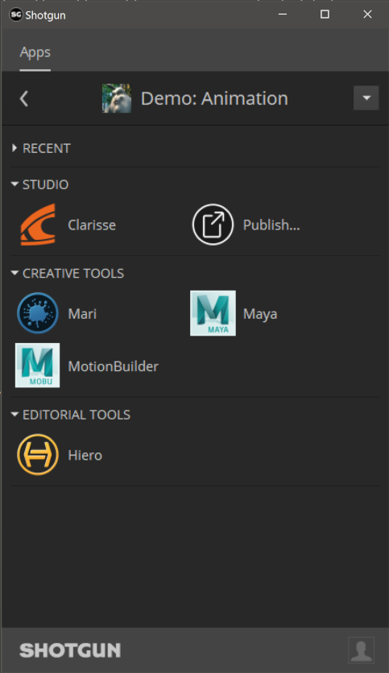

# Clarisse Shotgun toolkit engine

Contact : [Diego Garcia Huerta](https://www.linkedin.com/in/diegogh/)


## Overview

Implementation of a shotgun toolkit engine for [**Clarise iFX**](https://www.isotropix.com/products/clarisse/ifx). This engine is based on the [tk-maya engine](https://github.com/shotgunsoftware/tk-maya) heavily adapted to Clarisse. It supports the classic boostrap startup methodology and integrates with clarisse adding a shotgun menu in it's menu bar.

* [Engine Installation](#engine-installation)
* [Configuring your project for Shotgun Toolkit](#configuring-your-project-for-shotgun-toolkit)
* [Modifying the toolkit configuration files to add this engine and related apps](#modifying-the-toolkit-configuration-files-to-add-this-engine-and-related-apps)
* [Modifying the Templates](#modifying-the-templates)
* [Configuring Clarisse in the software launcher](#configuring-clarisse-in-the-software-launcher)
* [Caching and downloading the engine into disk](#caching-and-downloading-the-engine-into-disk)

With the engine, hooks for most of the standard tk application are provided:

* [tk-multi-workfiles2](#tk-multi-workfiles2)
* [tk-multi-snapshot](#tk-multi-snapshot)
* [tk-multi-loader2](#tk-multi-loader2)
* [tk-multi-publish2](#tk-multi-publish2)
* [tk-multi-breakdown](#tk-multi-breakdown)
* [tk-multi-setframerange](#tk-multi-setframerange) ( see notes below as this is a fork from the original shotgun repository to allow having hooks per engine, as the original one has support only for certain applications)

(I've also included a hook that allows to take a [thumbnail](hooks/thumbnail.py) of clarisse window, useful for configuring tk-multi-snapshot for example.)

**Note: This engine has been tested in Windows using Clarisse iFX version 3.6, and Clarisse iFX version 4.0 Learning Edition (just released at the time of writting)**


## Engine Installation

When I started using shotgun toolkit, I found quite challenging figuring out how to install and configure a new tk application or a new engine. Shotgun Software provides extensive documentation on how to do this, but I used the get lost in details, specially with so many configuration files to modify.

If you are familiar with how to setup an engine and apps, you might want to skip the rest of this document, just make sure to check the [templates](config/core/templates.yml) and [additions to the configs](config/env) that might give you a good start.

If you are new to shotgun toolkit, I recommend you to read at least the following shotgun articles, so you get familiar with how the configuration files are setup, and the terminology used:

* [App and Engine Configuration Reference](https://support.shotgunsoftware.com/hc/en-us/articles/219039878-App-and-Engine-Configuration-Reference)
* [Overview of Toolkit's New Default Configuration](https://support.shotgunsoftware.com/hc/en-us/articles/115004077494-Overview-of-Toolkit-s-New-Default-Configuration-)

Here are detailed instructions on how to make this engine work assuming you use a standard shotgun toolkit installation and have downloaded shotgun desktop.

[Shotgun Desktop Download Instructions](https://support.shotgunsoftware.com/hc/en-us/articles/115000068574#Getting%20started%20with%20Shotgun%20Desktop)


## Configuring your project for Shotgun Toolkit

If you haven't done it yet, make sure you have gone through the basic steps to configure your project to use shotgun toolkit, this can be done in shotgun desktop app, by:
* enter into the project clicking it's icon

* click on the user icon to show more options (bottom right)

* click on *Advanced project setup*

    

* *Select a configuration*: "Shotgun Default" or pick an existing project that you have already setup pages and filters for.


* *Select a Shotgun Configuration*: select "default" which will download the standard templates/configuration from shotgun. (this documentation is written assuming you have this configuration)


* *Define Storages*: Make sure you name your first storage "primary", and a choose a primary folder where all the 'jobs' will be stored, in this case "D:\demo\jobs" for illustrative purposes.


* *Project Folder Name*: This is the name of the project in disk. You might have some sort of naming convention for project that you might follow, or leave as it is. (My advice is that you do not include spaces in the name!)


* *Select Deployment*: Choose "Centralized Setup". This will be the location of the configuration files (that we will be modifying later). For example, you could place the specific configuration for a project (in this example called game_config) within a folder called "configs" at the same level then the jobs folder, something like: 
```shell
├───jobs
└───configs
    └───game_config
        ├───cache
        ├───config
        │   ├───core
        │   │   ├───hooks
        │   │   └───schema
        │   ├───env
        │   │   └───includes
        │   │       └───settings
        │   ├───hooks
        │   │   └───tk-multi-launchapp
        │   ├───icons
        │   └───tk-metadata
        └───install
            ├───apps
            ├───core
            ├───engines
            └───frameworks
```
(Note that this might not be suitable for more complex setups, like distributed configurations)


## Modifying the toolkit configuration files to add this engine and related apps

Every pipeline configuration has got different environments where you can configure apps accordingly. (for example you might want different apps depending if you are at an asset context or a shot context). The configured environments really depend on your projects requirements. While project, asset, asset_step, sequence, shot, shot_step, site are the standard ones, it is not uncommon to have a sequence_step environment or use a episode based environment either.

I've included a folder called 'config' in this repository where you can find the additions to each of the environments and configuration yml files that come with the [default shotgun toolkit configuration repository](https://github.com/shotgunsoftware/tk-config-default2) (as of writing) 

[configuration additions](config)

These yaml files provided **should be merged with the original ones as they won't work on their own.**

As an example, for the location of the engine, we use a git descriptor that allows up to track the code from a git repository. This become easy to update whenever a new version is released. So in the example above, you should modify the file:
``.../game_config/config/env/includes/engine_locations.yml``

and add the following changes from this file:
[engine_locations.yml](config/env/includes/engine_locations.yml)

```yaml
# Clarisse
engines.tk-clarisse.location:
  type: git
  branch: master
  path: https://github.com/diegogarciahuerta/tk-clarisse.git
  version: v1.0.0
```

Or in your environments you should add tk-clarisse yml file, for example in the asset_step yml file:
``/configs/game_config/env/asset_step.yml``

Let's add the include at the beginning of the file, in the 'includes' section:
```yaml
- ./includes/settings/tk-clarisse.yml
```

Now we add a new entry under the engines section, that will include all the information for our clarisse application:
```yaml
  tk-clarisse: "@settings.tk-clarisse.asset_step"
```

And so on.

Finally, do not forget to copy the additional `tk-clarisse.yml` into your settings folder.


## Modifying the Templates

The additions to `config/core/templates.yml` are provided also under the config directory of this repository, specifically:

[templates.yml](config/core/templates.yml)


## Configuring Clarisse in the software launcher

In order for Clarisse to show up in the shotgun launcher, we need to add it to our list of softwares that are valid for this project.

* Navigate to your shotgun url, ie. `example.shotgunstudio.com`, and once logged in, clink in the Shotgun Settings menu, the arrow at the top right of the webpage, close to your user picture. 
* Click in the Software menu

  

* We will create a new entry for Clarisse, called "Clarisse". The description was conveniently copied and pasted from Wikipedia.


* We should now specify the engine this software will use. "tk-clarisse"


* Note that you can restrict this application to certain projects by specifying the project under the projects column. If no projects are specified this application will show up for all the projects that have this engine in their configuration files.

If you want more information on how to configure software launches, here is the detailed documentation from shotgun.
[Configuring software launches](https://support.shotgunsoftware.com/hc/en-us/articles/115000067493#Configuring%20the%20software%20in%20Shotgun%20Desktop)


## Caching and downloading the engine into disk

One last step is to cache the engine and apps from the configuration files into disk. Shotgun provides a tank command for this. 
[Tank Advanced Commands](https://support.shotgunsoftware.com/hc/en-us/articles/219033178-Administering-Toolkit#Advanced%20tank%20commands)

* Open a console and navigate to your pipeline configuration folder, where you will find a `tank` or `tank.bat` file.
(in our case we placed the pipeline configuration under `D:\demo\configs\game_config`)

* type `tank cache_apps` , and press enter. Shotgun Toolkit will start revising the changes we have done to the configuration yml files and downloading what is required, in this case the engine and the changes for tk-multi-setframerange app listed below.


## Clarisse engine should be ready to use

If we now go back and forth from our project in shotgun desktop ( < arrow top left if you are already within a project ), we should be able to see Clarisse as an application to launch.




## [tk-multi-workfiles2](https://support.shotgunsoftware.com/hc/en-us/articles/219033088)
This application forms the basis for file management in the Shotgun Pipeline Toolkit. It lets you jump around quickly between your various Shotgun entities and gets you started working quickly. No path needs to be specified as the application manages that behind the scenes. The application helps you manage your working files inside a Work Area and makes it easy to share your work with others.

Basic hooks have been implemented for this tk-app to work. open, save, save_as, reset, and current_path are the scene operations implemented.

## [tk-multi-snapshot](https://support.shotgunsoftware.com/hc/en-us/articles/219033068)
A Shotgun Snapshot is a quick incremental backup that lets you version and manage increments of your work without sharing it with anyone else. Take a Snapshot, add a description and a thumbnail, and you create a point in time to which you can always go back to at a later point and restore. This is useful if you are making big changes and want to make sure you have a backup of previous versions of your scene.

Hooks are provided to be able to use this tk-app, similar to workfiles2.

## [tk-multi-loader2](https://support.shotgunsoftware.com/hc/en-us/articles/219033078)


The Shotgun Loader lets you quickly overview and browse the files that you have published to Shotgun. A searchable tree view navigation system makes it easy to quickly get to the task, shot or asset that you are looking for and once there the loader shows a thumbnail based overview of all the publishes for that item. Through configurable hooks you can then easily reference or import a publish into your current scene.

The hooks provided support all the input reference and import formats from Clarisse, from alembic files, usd files (Clarisse iFX v4.0+), lwo, obj, Clarisse project files, etc...

## [tk-multi-publish2](https://support.shotgunsoftware.com/hc/en-us/articles/115000097513)


The Publish app allows artists to publish their work so that it can be used by artists downstream. It supports traditional publishing workflows within the artist’s content creation software as well as stand-alone publishing of any file on disk. When working in content creation software and using the basic Shotgun integration, the app will automatically discover and display items for the artist to publish. For more sophisticated production needs, studios can write custom publish plugins to drive artist workflows.

Only the basic publishing of the current session is provided with this app. 

## [tk-multi-breakdown](https://support.shotgunsoftware.com/hc/en-us/articles/219032988)


The Scene Breakdown App shows you a list of items you have loaded (referenced) in your scene and tells you which ones are out of date. From this overview, you can select multiple objects and click the update button which will update all your selected items to use the latest published version.

Hook provided support the updating of the following type of nodes (basically, alembic, usd, or any other geometric format supported at the time of writting):
- GeometryPolyfile
- GeometryFurFile
- GeometryVolumeFile
- GeometryBundleAlembic
- GeometryBundleUsd
- ProcessAlembicExport
- LightPhysicalSphere
- TextureMapFile
- TextureStreamedMapFile
- TextureOslFile

## [tk-multi-setframerange](https://support.shotgunsoftware.com/hc/en-us/articles/219033038)
This is a simple yet useful app that syncs your current file with the latest frame range in Shotgun for the associated shot. If a change to the cut has come in from editorial, quickly and safely update the scene you are working on using this app. Towards the end, it will display a UI with information about what got changed.

This app has been forked so it can include it's own hooks. The original implementation from shotgun software had the engines logic hardcoded, so I went ahead and refactored it to be able to support hooks per engine. You should configure this app from the following repository and branch:
[tk-multi-setframerange enable_hooks_for_app](https://github.com/diegogarciahuerta/tk-multi-setframerange/tree/enable_hooks_for_app)

The location section for this app should look like:
```yaml
      location:
        type: git_branch
        branch: enable_hooks_for_app
        path: https://github.com/diegogarciahuerta/tk-multi-setframerange
        version: b24a977
```
where version represents the commit id. (at the time of writting the latest commit)
(note that the hook for clarisse is however included with the tk-clarisse engine)

For completion, I've kept the original README from shotgun, that include very valuable links:

## Documentation
This repository is a part of the Shotgun Pipeline Toolkit.

- For more information about this app and for release notes, *see the wiki section*.
- For general information and documentation, click here: https://support.shotgunsoftware.com/entries/95441257
- For information about Shotgun in general, click here: http://www.shotgunsoftware.com/toolkit

## Using this app in your Setup
All the apps that are part of our standard app suite are pushed to our App Store. 
This is where you typically go if you want to install an app into a project you are
working on. For an overview of all the Apps and Engines in the Toolkit App Store,
click here: https://support.shotgunsoftware.com/entries/95441247.

## Have a Question?
Don't hesitate to contact us! You can find us on support@shotgunsoftware.com
